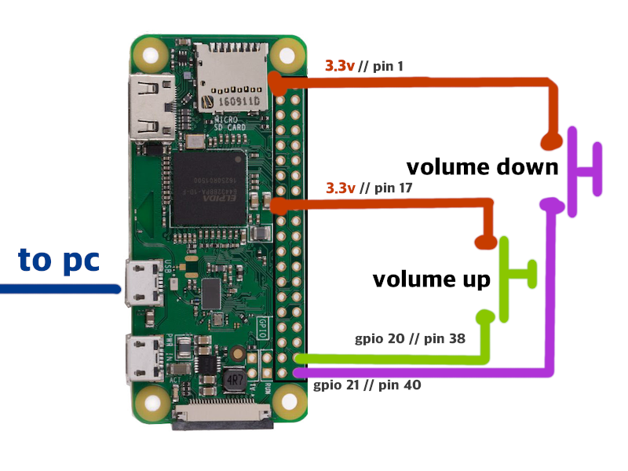

### What is this?

Turn your Raspberry Pi (or other Linux device capable of being a USB Gadget) to a multimedia keyboard with volume controls!

It uses a daemon to control what actions should be taken over USB depending on GPIO inputs, by default volumeUpPin is GPIO input 20 and volumeDownPin is 21. If you hold both volume up and down together it'll play/pause media.

This is all easily configurable inside the daemon.

### Easy install guide for Raspberry Pi Zero (W)

1. Flash Raspbian onto the SD card of the Zero with the Raspberry Pi Imager
   - IMPORTANT: make sure to add an SSH login and wifi credentials to access the device
2. Plug the raspberry pi into your computer using the data microUSB port (the second one from the edge)
3. SSH into your pi and clone the repo with `git clone https://github.com/benjamingwynn/usb-volume-control`
4. cd into `usb-volume-control` and run the `./rpi-zero-install.sh` script

### Manual installation

1. Prepare your system for use as a USB gadget
   - load `dwc2` and `libcomposite` kernel modules on boot
   - add `dtoverlay=dwc2` to your Pi's boot config.txt if using a Raspberry Pi
2. Install the `mkdevice.sh` script somewhere, it needs to be ran on root at startup to create the keyboard USB device.
3. Run `daemon/daemon.mjs` using node.js to monitor GPIO pins and emit events to the emulated USB keyboard.

### References/further reading

The following resources were very helpful in putting this all together:

USB HID/USB Gadget/Raspberry Pi:

- http://www.isticktoit.net/?p=1383
- https://randomnerdtutorials.com/raspberry-pi-zero-usb-keyboard-hid/
- https://www.kernel.org/doc/Documentation/usb/gadget_configfs.txt
- https://github.com/ckuethe/usbarmory/wiki/USB-Gadgets

Multimedia/CBB keys:

- https://github.com/piraija/usb-hid-and-run
- https://learn.microsoft.com/en-us/previous-versions/windows/hardware/design/dn613956(v=vs.85)
- https://github.com/DevOps-Nirvana/python-usb-gadget-send-multimedia-hid-commands?tab=readme-ov-file
- https://www.stefanjones.ca/blog/arduino-leonardo-remote-multimedia-keys/
- https://github.com/mtlynch/ansible-role-key-mime-pi/blob/master/files/enable-rpi-hid
- https://www.ccsinfo.com/forum/viewtopic.php?t=59253
- https://web.archive.org/web/20180706083533/http://www2.ece.rochester.edu/~parihar/pres/Report_MultiMedia-KB.pdf

GPIO:

- https://docs.kernel.org/next/admin-guide/gpio/sysfs.html
- https://www.electronicsforu.com/electronics-projects/hardware-diy/accessing-gpios-using-sysfs-interface-linux
- https://github.com/JamesBarwell/rpi-gpio.js/blob/master/rpi-gpio.js#L284
